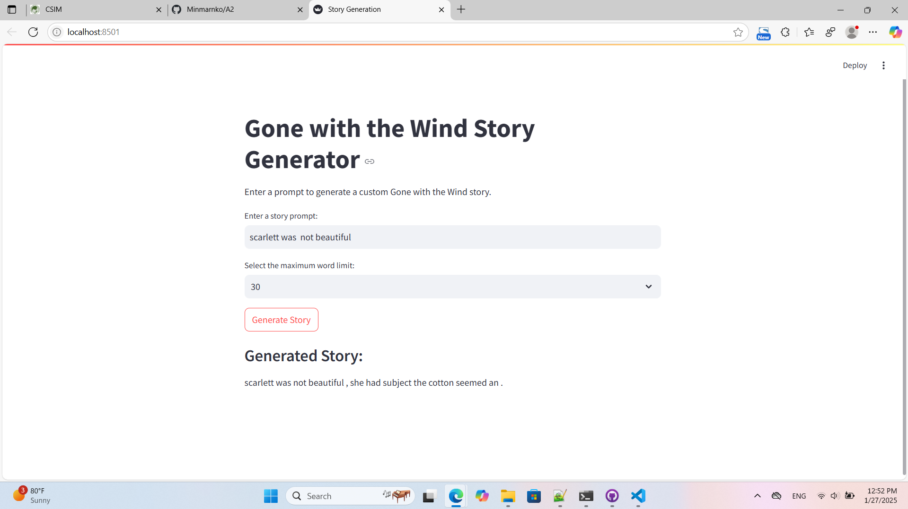

# NLP A2
 AIT NLP Assignment 2

- [Student Information](#student-information)
- [Installation and Setup](#installation-and-setup)
- [Usage](#usage)
- [Training Data](#training-data)
- [Model Architecture](#model-architecture)
- [Training Process](#training-data)
- [Results](#results)
- [Web application and model interface](#web-application-and-model-interface)

## Student Information
Name - Min Marn Ko
ID - st125437

## Installation and Setup
Webapp at localhost:8501

## Usage
- **Input:**  
  After launching the web app, you'll see a textbox labeled **"Enter a story prompt"**. Here, you can type the beginning of your story, but avoid using periods (`.`) or question marks (`?`). If such punctuation is included, the model may interpret the input as a complete sentence and generate a sequence of periods or question marks instead of meaningful text.  
  Example: *"Scarlett was brave and determined"* (valid prompt).

- **Output:**  
  After entering your prompt, you can select the **maximum word limit** (10, 20, or 30 words) using the dropdown menu. Click the **"Generate Story"** button, and the model will generate a continuation of the story based on your prompt. The result will be displayed below the input field as the "Gone with the Wind" themed story.

## Training Data
Corpus source - Margaret Mitchell's Gone With The Wind (Project Gutenberg Australia - https://gutenberg.net.au/)  
Training - 38792 rows  
Validation - 4849 rows  
Testing - 4850 rows  
Vocabulary Size |V| - 6994

The dataset for this project was uploaded to the Hugging Face Dataset Hub and loaded using the `datasets.load_dataset` method. It was then split into training, validation, and test sets. Initially, 80% of the data was allocated for training, while the remaining 20% was kept as a temporary set. The temporary set was further divided evenly into validation and test sets, resulting in a final split of 80% for training, 10% for validation, and 10% for testing. This was organized into a `DatasetDict` for streamlined processing.

To prepare the data for the LSTM model, the `torchtext` library’s `get_tokenizer` function was used to tokenize the text data. The tokenized content was stored in a new column named `tokens`. A vocabulary was then built from the tokenized data, including words that occurred more than three times, alongside special tokens `<unk>` (unknown) and `<eos>` (end of sequence). The vocabulary was configured to return `<unk>` for out-of-vocabulary words.

After tokenization and vocabulary creation, the data was divided into 128 batches. Each batch was further segmented into source inputs with a sequence length of 50 tokens to align with the LSTM model’s input requirements. This preprocessing step ensured the dataset was efficiently prepared for training, validation, and testing within the language model framework.

## Model Architecture
The `LSTMLanguageModel` is a PyTorch-based stacked LSTM model designed for text generation tasks. It includes an embedding layer that converts word indices into dense vector representations of size `emb_dim`, enhancing the richness of word representations. A stacked LSTM with `num_layers` processes the embeddings while maintaining sequential information, with dropout applied to prevent overfitting. A fully connected layer maps the LSTM outputs to vocabulary scores for generating predictions. The model initializes weights carefully, with embedding weights uniformly distributed in the range \([-0.1, 0.1]\), and weights for the fully connected layer and LSTM input-to-hidden (\(W_e\)) and hidden-to-hidden (\(W_h\)) connections initialized within a range of \([-1/\sqrt{\text{hid_dim}}, 1/\sqrt{\text{hid_dim}}]\). Biases are initialized to zero.

The model provides methods to manage its hidden states. The `init_hidden` method initializes the hidden and cell states to zeros with shapes matching the LSTM dimensions, while the `detach_hidden` method detaches these states from the computation graph to avoid gradient backpropagation across sequences. During the forward pass, input sequences are processed through the embedding, LSTM, dropout, and fully connected layers, producing predictions in the form of vocabulary logits and updated hidden states. The design enables the model to effectively learn and generate coherent text by capturing sequential patterns and dependencies in the input data.

## Training process
The training process is carried out using the Adam optimizer instead of the ASGD optimizer used in the referenced paper, and the loss function is set as `CrossEntropyLoss`. The total number of trainable parameters in the model is calculated to be 31,124,306. To dynamically adjust the learning rate, the `ReduceLROnPlateau` scheduler is employed, which reduces the learning rate by a factor of 0.5 if the validation loss does not improve within a set patience period. Gradient clipping is implemented using `clip_grad_norm` to prevent exploding gradients during training.

The hidden states of the LSTM model are retained across batches to preserve sequential information but are detached at the start of each batch to save computational resources. These hidden states are reinitialized to zeros at the beginning of each epoch. Dropout layers are set to training mode during the training phase (`model.train()`) and evaluation mode during validation and testing (`model.eval()`).

The training process uses a batch size defined by the input data and divides the data into sequences of 50 tokens. The `get_batch` function extracts input (`src`) and target (`target`) batches, where the target sequence is shifted one token ahead of the source sequence. For each batch, the forward pass computes predictions, reshapes them to match the dimensions required by the loss function, and calculates the loss. The gradients are computed using backpropagation, clipped, and applied to update the model parameters. The average loss per epoch is calculated and returned.

For evaluation, the model is run in inference mode (`model.eval()`), and no gradients are calculated. Similar to training, batches are processed sequentially, and the average validation loss is computed.

The training runs for 100 epochs with a sequence length of 50 tokens and a gradient clipping value of 0.25. A learning rate scheduler adjusts the optimizer's learning rate based on the validation loss. The model's state is saved whenever the validation loss achieves a new minimum. Every 10 epochs, the training and validation perplexity scores are printed to monitor the model's performance.

Key model parameters include:
- Vocabulary size: 50
- Embedding dimension: 1024 (increased from 400 in the paper)
- Hidden dimension: 1024 (reduced from 1150 in the paper)
- Number of LSTM layers: 2 (reduced from 3 in the paper)
- Dropout rate: 0.65
- Learning rate: 0.001

To ensure reusability, key model configurations and metadata such as vocabulary size, embedding and hidden dimensions, number of layers, dropout rate, tokenizer, and vocabulary are saved in a dictionary and serialized to a `.pkl` file for future use. 

The final model achieves training and validation perplexity values, which are periodically logged during the training process, demonstrating its learning progression. This robust setup facilitates effective language model training and validation while maintaining computational efficiency.

## Results
Training perplexity - 66.747  
Validation perplexity - 105.329
Testing perplexity - 101.380

## Web application and model interface
The web application is designed to generate a "Gone with the Wind"-style story based on user input. It uses Streamlit for the interface, providing an input box for users to type a prompt and a dropdown menu to select the maximum sequence length (10, 20, or 30 words). The backend loads a pre-trained LSTM model along with its tokenizer and vocabulary from a saved `Data.pkl` file. The generation process begins by passing the user-provided prompt to the `generate` function, which predicts one word at a time, appending each new word to the input until the specified word limit is reached or an `<eos>` token appears. The final generated text is displayed back to the user as a complete story. Enhancements to the code include dynamic handling of the vocabulary size based on the loaded data, robust error handling for cases like missing files or loading issues, and additional user controls for generation parameters, such as temperature and random seed, to allow greater customization of the output. These improvements ensure the application is both functional and user-friendly.

## Screenshot

